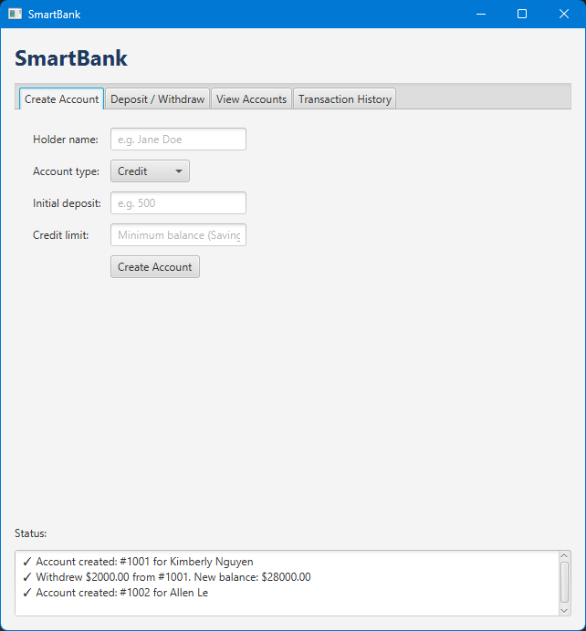
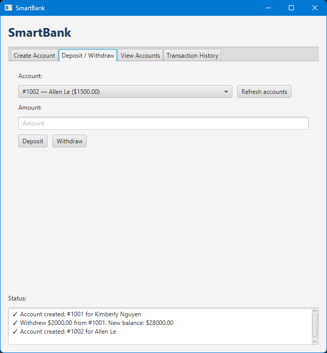
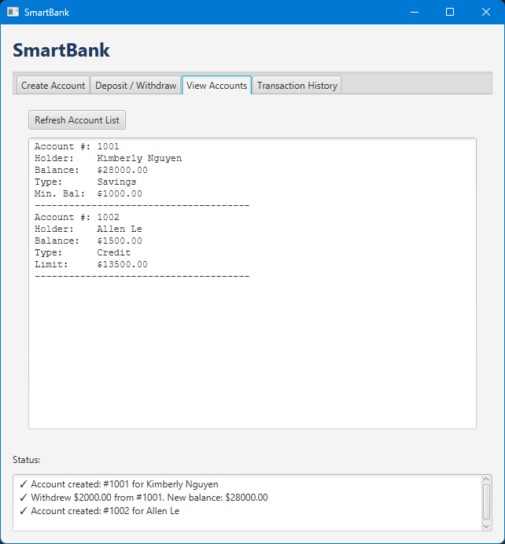
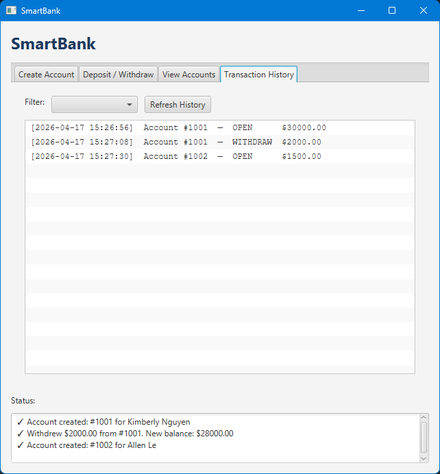

# SmartBank Banking Application

SmartBank is a desktop banking application developed in Java using JavaFX. The project was created to apply object-oriented programming concepts while simulating common banking operations such as account creation, deposits, withdrawals, and transaction tracking.

## Application Preview

### Create Account
Create savings or credit accounts by entering the account holder's information, starting balance, and account-specific requirements.



### Deposit & Withdraw
Perform deposits and withdrawals for existing accounts through the transaction interface.



### View Accounts
View account information, account types, balances, and other account details.



### Transaction History
Review recorded deposits and withdrawals through the application's transaction history.



## Features

- Create and manage different types of bank accounts
- Support for savings and credit accounts
- Deposit and withdraw funds
- View account balances and account information
- Record and display transaction history
- Validate transactions based on account requirements
- Handle insufficient balances using a custom exception
- Navigate the application through a JavaFX graphical user interface

## Technologies Used

- Java
- JavaFX
- Object-Oriented Programming (OOP)
- Eclipse IDE

## How to Run

### Requirements

- Java Development Kit (JDK) 21
- JavaFX SDK
- A Java IDE such as Eclipse or IntelliJ IDEA

### Setup

1. Clone or download this repository.
2. Open the project in your preferred Java IDE.
3. Configure the project to use JDK 21.
4. Add the JavaFX SDK `lib` folder to the project's module path.
5. Run `Main.java` located in `src/application/`.

If JavaFX is not configured automatically, add the following VM arguments and replace the path with the location of your JavaFX SDK:

```text
--module-path "path/to/javafx-sdk/lib" --add-modules javafx.controls,javafx.fxml

## Object-Oriented Programming Concepts

This project demonstrates several core object-oriented programming concepts:

### Inheritance
`SavingsAccount` and `CreditAccount` extend the base `BankAccount` class, allowing shared account behavior to be reused while supporting account-specific functionality.

### Encapsulation
Account information and transaction data are managed through classes and methods that organize the application's data and behavior.

### Polymorphism
Different account types can implement account operations differently based on their individual requirements.

### Exception Handling
A custom `InsufficientBalanceException` is used to handle transactions that cannot be completed because of account balance requirements.

## Project Structure

```text
src/
├── module-info.java
└── application/
    ├── Main.java
    ├── BankAccount.java
    ├── SavingsAccount.java
    ├── CreditAccount.java
    ├── Transaction.java
    ├── InsufficientBalanceException.java
    └── application.css

What I Learned

Through this project, I gained hands-on experience designing a Java application using object-oriented programming principles. I also strengthened my understanding of inheritance, exception handling, collections, account validation logic, and building graphical user interfaces with JavaFX.

## Future Improvements

Some improvements I would like to explore include:

- Saving account information to a database
- Adding user authentication
- Improving input validation
- Expanding transaction filtering and account history
- Refining the user interface

## Author

**Kimberly Nguyen**

Information Systems Student interested in cybersecurity, cloud computing, and software development.
